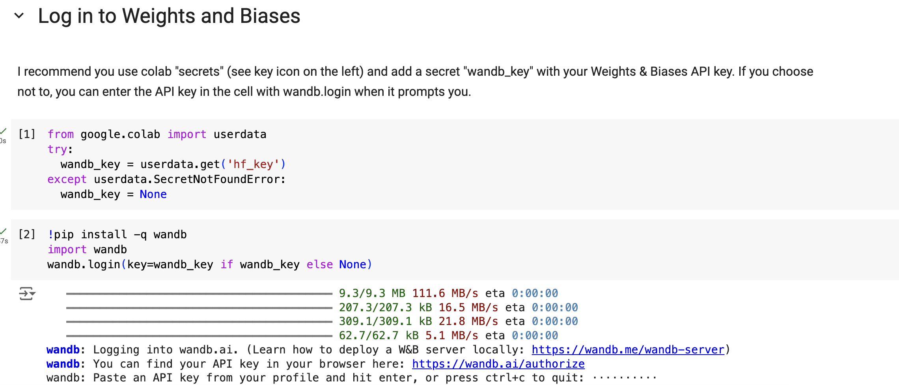
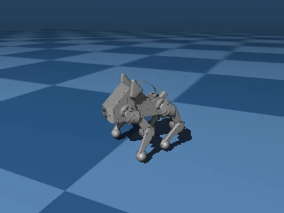
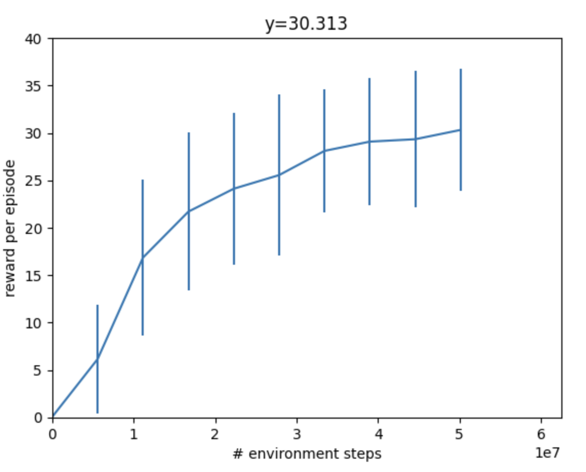
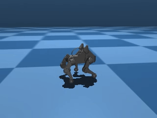
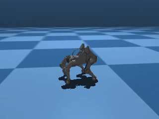
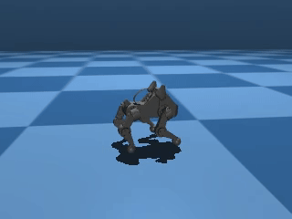
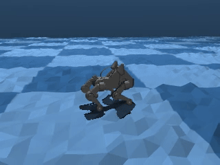

Lab 5: How to Train Your Dog
========================

*Goal: Train Pupper to walk using reinforcement learning!*

`Lab slides <https://docs.google.com/presentation/d/1APi029vOGI_dR0Vrvh3glQ0Bw61qV4XP/edit?usp=sharing&ouid=117110374750562018236&rtpof=true&sd=true>`_

`Lab document <https://docs.google.com/document/d/19SxabuzXPwqu-q0i3K2NRWW-GlK_V9ndIN5UgcBE58c/edit?usp=sharing>`_

Step 1. Colab setup
^^^^^^^^^^^^^^^^^^^^^^^^^^^^^^^^^^^^^^^^
#. Make a copy of the Colab notebook `HERE <https://colab.research.google.com/drive/1QBtJ09hNInqNqKPVRThbv_yppSlQ9qd2?usp=sharing>`_
#. Purchase Colab Pro and set the GPU to A100. Select runtime in top panel -> change runtime type -> A100
#. Create a wandb account (https://wandb.ai/), navigate to User Settings, and generate an API key
#. Set up your wandb key by running cell 2 and inserting your key
#. Run all cells up until Config to install dependencies

   Insert your wandb key here

Step 2. Velocity tracking
^^^^^^^^^^^^^^^^^^^^^^^^^^^^^^^^^^^^^^^^
Let's implement a naive reward function for Pupper velocity tracking

#. Run everything up the "Update the configs" cell. Change the tracking_lin_vel and tracking_ang_vel values to be nonzero to get Pupper to follow a velocity command. Refer to the `reward definitions <https://github.com/Nate711/pupperv3-mjx/blob/main/pupperv3_mjx/rewards.py>`_ . In practive the linear velocity tracking coefficient should be around double the angular velocity tracking
#. Run the ENVIRONMENT and TRAIN cells to load in the Pupper flat environment and train Pupper to follow a desired velocity
#. Pupper should take around 5-10 minutes to train. 

DELIVERABLE: We use a exponential tracking function for Pupper to track a desired velocity. Since Pupper needs to maximize this function, should the reward coefficient be positive or negative? How else could you implement a velocity tracking function? Write it down in math.

DELIVERABLE: Visualize Pupper's progress every ~100 episodes. How does Pupper look 100 episodes in? How does this relate to the reward you coded?

DELIVERABLE: Screen recording of walking in simulation

   Earlier in training, Pupper will move seemingly randomly

   During training, your reward should be going up steadily and eventually plateau

   Just because Pupper has velocity tracking reward doesn't mean it will perfectly follow the desired speed. To learn natural gaits, auxiliary rewards are needed. Next, you will implement a function to encourage Pupper to walk more efficiently.

Step 3. Effort function
^^^^^^^^^^^^^^^^^^^^^^^^^^^^^^^^^^^^^^^^
#. Edit configs cell to write a reward function that helps Pupper conserve effort. Which rewards should be nonzero to encourage Pupper to conserve energy?
#. Run the ENVIRONMENT and TRAIN cells to load in the Pupper flat environment and train Pupper to walk forward more efficiently
#. Pupper should take around 5-10 minutes to train. 

DELIVERABLE: What is your reward function (in math)? Why did you choose this function? What existing reward terms could be used be used to make Pupper conserve energy, and what are their potential pros and cons? Are there any rewards that could be used that are not listed?

DELIVERABLE: Qualitatively, how does this Pupper policy compare to the previous one?

DELIVERABLE: Screen recording of stand-up in simulation

   Pupper should walk with much better stability and smoothness. However, it still shouldn't have a super natural locomotion, and will likely not be robust to pushes or other changes in the environment. Next, you will implement several additional auxiliary rewards to help Pupper stay stable.

Step 4. Reward tuning
^^^^^^^^^^^^^^^^^^^^^^^^^^^^^^^^^^^^^^^^

#. Edit the config to Pupper smoothly follow velocities with a natural gait. Feel free to use any rewards you like
#. Reload the environment, and train Pupper to walk in sim
#. Pupper should take around 10-15 minutes to train. 

DELIVERABLE: What terms are included in your reward functions? What coefficients did you use? How did you come up with these terms and what was their desired effect? Why might this policy perform poorly on the physical robot?

DELIVERABLE: Visualize Pupper's progress every ~100 episodes. How does Pupper look 100 episodes in? How does this relate to the reward you coded?

DELIVERABLE: Screen recording of stand-up in simulation

   You should aim to train a stable policy up to 0.75 m/s in simulation

Step 5. Deploy your walking policy
^^^^^^^^^^^^^^^^^^^^^^^^^^^^^^^^^^^^^^^^

|
Transfer policy from local machine to pupper

#. Download the `deploy script <https://drive.google.com/file/d/1QGo_Xxu2WMjDWeD3gIkbu1fEC68U6osG/view?usp=sharing>`_ on your local machine 
#. Make it executable: chmod +x deploy_policy.sh
#. Download the policy you trained in colab
#. Connect your remote controller with the USB cable to give Pupper velocity commands
#. Run the policy: ./deploy_policy.sh /path/to/your/policy.json

DELIVERABLE: In what ways is this policy different on the physical robot (compared to sim)

DELIVERABLE: Take video of walking

.. figure:: ../../../_static/walker.gif
   :align: center

   Deploy your policy on Pupper v3

Step 6. Domain randomization
^^^^^^^^^^^^^^^^^^^^^^^^^^^^^^^^^^^^^^^^^^^^^^^^^^^^^^^^^^^^

Okay, so Pupper looks pretty good in sim, but the policy doesn't look so great in the real world...

You will need to add randomization to the sim environment so your policy successfully transfers. Consider randomizing parameters such as Pupper mass, environment heighfields, or PID gains.

#. Edit the environment config to adequately represent all the situations Pupper might encounter in the real world
#. Try several magntidues of the domain randomization terms to see what works
#. Iterate many times tuning the domain randomization and rewards for the best policy possible! An agile policy should be fast, efficient, stable, and robust to disturbances. Train the bes policy you can!

   Your sim environment should expose Pupper to a variety of possible scenarios

DELIVERABLE: Comment on what happens if you add too much domain randomization

DELIVERABLE: Record a video on the obstacle course and record a video

DELIVERABLE: Describe your approach to training an agile Pupper policy. What parameters were key? Did you use a heightfield? Why/why not?

Resources
-----------
`Learning to Walk in Minutes Using Massively Parallel Deep Reinforcement Learning <https://arxiv.org/pdf/2109.11978>`_

`Sim-to-Real: Learning Agile Locomotion For Quadruped Robots <https://arxiv.org/abs/1804.10332>`_

`Minimizing Energy Consumption Leads to the
Emergence of Gaits in Legged Robots <https://energy-locomotion.github.io/>`_

`Learning Agile Quadrupedal Locomotion Over Challenging Terrain <https://www.science.org/doi/full/10.1126/scirobotics.abc5986>`_
