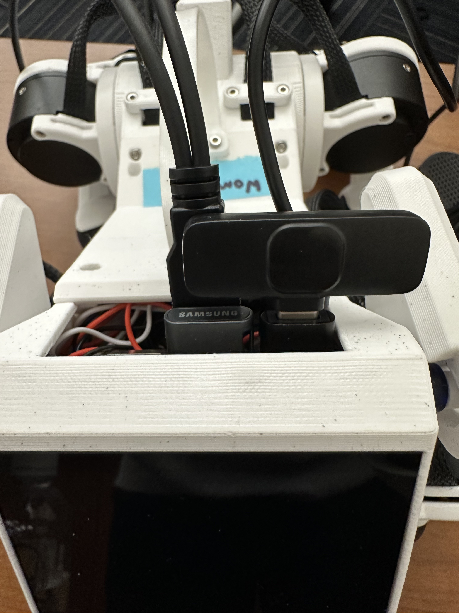
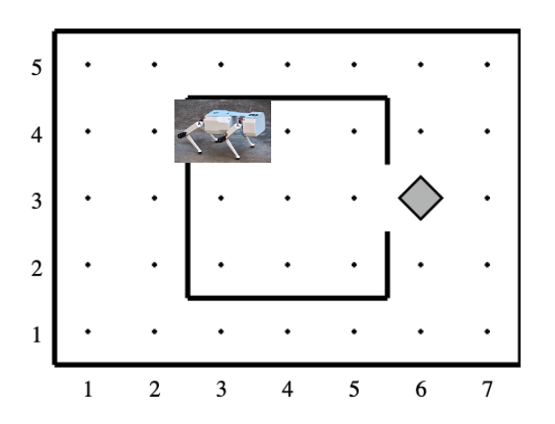

Lab 6: Do What I Say
=============================================

*Goal: Explore how we can use LLMs and speech recognition to control Pupper to do a variety of tasks! Benchmark this method against using a pre-trained CNN or Resnet architecture for speech recognition.*

For this lab, we are going to implement a speech recognition pipeline to command Pupper with voice/speech input. To do so, we will hone ROS implementation skills to add various capabilities to Pupper, which will also be helpful for your final project. If anything is not working as expected or you have any questions, please ask a TA.

Fill out the lab document as you complete this lab: https://docs.google.com/document/d/1dU70gedHd83s3HA9g-nIzRdMnL8tlony3w4H7Th0NOA/edit?usp=sharing.

Step 0. Revert to Default Policy from Lab 5
^^^^^^^^^^^^^^^^^^^^^^^^^^^^^^^^^^^^^^^^^^^^^

`You only need to complete this step if you have completed Lab 5 recently, and overwrote the default walking policy on the robot. This step is to point the robot to run the default policy rather than the walking policy you trained last lab. If you would like to run any of your own policys again in the future, you must do the inverse of this step and build the workspace again.`

1. Turn on your Pupper, and go to this link to find the default walking policy: https://github.com/G-Levine/neural_controller/blob/main/launch/policy.json. Download the file ``policy.json``, and ensure it is in your `Downloads` directory.

2. Run the fllowing command

   .. code-block:: bash

      cd ~/Downloads
      mv policy.json ~/ros2_ws/src/neural_controller/launch/default_policy.json

3. Open the file `~/ros2_ws/src/neural_controller/launch/config.yaml` in VSCode. In line 105, change the line to point to ``default_policy.json``. It should now say ``model_path: "$(find-pkg-share neural_controller)/launch/default_policy.json"``. Save the file

4. Open the file `~/.bashrc` in VSCode. Add the following line to the end of the file, and save:

   .. code-block:: bash

      alias build="cd $HOME/ros2_ws && colcon build --symlink-install --cmake-args -DCMAKE_BUILD_TYPE=RelWithDebInfo -DCMAKE_EXPORT_COMPILE_COMMANDS=ON && cd -"

5. In a terminal, run ``source ~/.bashrc``. Then, run ``build`` to build the workspace packages to make the change to run the default policy. Close and reopen any terminals to make sure that the changes persist in all shells. 

Step 1. Getting Started
^^^^^^^^^^^^^^^^^^^^^^^^^^^^^^^^^^^^^^^^^^^^^

1. Before turning on your Pupper, plug in your USB memory stick to the Pupper in the right side, top row port. Plug in the USB Splitter to the right side, bottom row port. Plug the keyboard and mouse into each end of the USB splitter. 

    Microphone cable inserted into the Raspberry Pi.

2. Turn on the Pupper, and install the related python packages

   .. code-block:: bash

      pip install pygame
      pip install simpleaudio
      pip install openai
      pip install openai-whisper
      pip install sounddevice
      pip install pyttsx3

Navigate to the folder `~/pupper_llm/pupper_llm/Robot_Commands/` and run the following command. If some dependencies are not working, please let a TA know!

   ..code-block:: bash

      pip install -r requirements.txt

3. Clone the starter code into the Pupper

   .. code-block:: bash

      cd ~/
      git clone https://github.com/cs123-stanford/pupper_llm_student.git pupper_llm

Step 2. Use the Karel Pupper API
^^^^^^^^^^^^^^^^^^^^^^^^^^^^^^^^

1. For much of this lab, we will be using the KarelPupper API. Much like the CS106A programming introduction, we use the KarelPupper API to do basic commands to control Pupper. In our case, using this API abstracts away the minute motor control commands and makes code much more readable for something like an LLM. The following excercises will help you get familiar with the API, which is something that many students build on top of for their final projects.

    Pupper in the Karel Environment.

2. Experiment with the KarelPupper API by running the `karel_test.py` script. Take a look at the script, and see if you can understand what Pupper should do before you run the script, and then run the script to validate your thoughts. In a first terminal, run

**IMPORTANT NOTE:** To run a script on this step, you should uncomment the line that has ``rclpy.init()`` in Line 14 of `~/pupper_llm/pupper_llm/karel/karel.py`. After completing this step, comment the line again.

   .. code-block:: bash

      cd ~/pupper_llm/launch
      ros2 launch launch.py

In a second, run
   .. code-block:: bash

      cd ~/pupper_llm/pupper_llm/karel
      python3 karel_test.py

3. Use the KarelPupper API to control Pupper to do a new action in a new python file. Do this by chaining together many commands together, which you can see available in the `karel.py` file. If required, you can further tune the hardcoded numbers for moving Pupper in `karel.py` or implement your own high-level commands.

**DELIVERABLE:** Submit your new python file to control Pupper with the KarelPupper API to Gradescope. Write a short blurb about what you commanded Pupper to do. Write about any tuning or new command implementations you made. Tkae a video and upload to Gradescope with your submission.

Step 3. Create a Simple Chat with GPT Through the Command Line
^^^^^^^^^^^^^^^^^^^^^^^^^^^^^^^^^^^^^^^^^^^^^^^^^^^^^^^^^^^^^^^

1. Our first step to implement our speech recognition pipeline is to ROSify the ChatGPT API. While we all know we can chat with ChatGPT through the web app, we will need to be able to send the responses to ChatGPT through a series of ROS publishers and subscribers. Open VSCode, and find the `simple_gpt_chat.py` file at `~/pupper_llm/pupper_llm/simple_scripts/`. This script will get responses from the ChatGPT API based on user queries. 

2. Refer to the Canvas announcement for the OpenAI API key. Paste the key in line 6 in the `TODO`. This will allow you to ping the ChatGPT API. 

3. Remember that a callback function in ROS is a function that gets automatically called when a specific event occurs, such as receiving a message on a topic, a service request, or a timer event. In Line 13, we create a subscriber `self.subscription` that runs the callback function `query_callback` everytime the `/user_query_topic` ROS topic receives a message. Implement the `query_callback` function according to the description in the file. Refer to the `String Message <https://docs.ros2.org/foxy/api/std_msgs/msg/String.html>`_ documentation.

4. When we call the ChatGPT API, we need to pass in a default prompt. Tuning this prompt to use ChatGPT as a helpful assistant is a process called `prompt engineering <https://platform.openai.com/docs/guides/prompt-engineering>`_. Fill out the `prompt` variable with a Python string containing your prompt. In the following lines, this is used in the response variable to start your conversation with ChatGPT.

5. Open the file `command_line_publisher` at `~/pupper_llm/pupper_llm/Robot_Commands/`. This script will be used to send queries to the ChatGPT API at the `user_query_topic` that the `simple_gpt_chat.py` script subscribes to. 

6. Similarly to the Step 3, implement the `publish_message` method according to the description in the file. 

7. Run your implementation. In a first terminal, run the commands

   .. code-block:: bash

      cd ~/pupper_llm/pupper_llm/simple_scripts
      python3 simple_gpt_chat.py

In a second terminal, run the commands

   .. code-block:: bash

      cd ~/pupper_llm/pupper_llm/Robot_Commands
      python3 command_line_publisher.py

**DELIVERABLE:** Experiment with different prompts. Engineer a prompt that you can use to control Pupper at a high level. Include your prompt in the Lab Document.

You should now be able to send queries through the second terminal, and see responses from the ChatGPT API in the first terminal (with the debug statements in your implemented methods uncommented). Congrats! You have now just ROSified ChatGPT!

Step 4. Use the Whisper API to Send Voice Input to ChatGPT
^^^^^^^^^^^^^^^^^^^^^^^^^^^^^^^^^^^^^^^^^^^^^^^^^^^^^^^^^^

1. The Whisper API is a state-of-the-art automatic speech recognition (ASR) system. The Whisper API enables developers to integrate speech-to-text capabilities into their applications by sending audio files to the API and receiving a transcription of the spoken content. We will use Whisper to send voice commands to Pupper. Paste the API key from the Canvas announcent to line 7. 

2. Copy your implementation of `publish_message` in the file `whisper_ping.py` in the folder `~/pupper_llm/pupper_llm/simple_scripts`. The rest of the code is implemented for you. The code essentially receives input from a USB microphone, parses it at regular intervals, and sends that to `user_query_topic` (just as `command_line_publisher.py`)

3. Plug in your USB microphone receiver to the Pi, using the USB-A to USB-C adapter (refer to the beginning image). Plug it into the left side top row of the USB ports (with the right side above the memory stick). Plug in the USB speaker to the remaining port (left side bottom row). Turn on the microphone transmitter. Check that audio is being received by opening the Settings app, and navigate to the Sound menu. See if the bar for the microphone moves when you speak into the transmitter.

4. Run your code. In a first terminal, run the commands

   .. code-block:: bash

      cd ~/pupper_llm/pupper_llm/simple_scripts
      python3 simple_gpt_chat.py

In a second terminal, run the commands

   .. code-block:: bash

      cd ~/pupper_llm/pupper_llm/simple_scripts
      python3 whisper_ping.py

You should now be able to speak into the microphone transmitter, and see the second terminal output the speech-to-text response from the Whisper API, and ChatGPT's response in the first terminal.

**DELIVERABLE** Do you notice any latency problems with the Whisper API? Try to increase/decrease the `dur` variable in `main.py` to see the effect on latency. Report your findings in the lab document, and why you think your changes led to your empirical findings.

Step 5. Make ChatGPT command the KarelPupper API
^^^^^^^^^^^^^^^^^^^^^^^^^^^^^^^^^^^^^^^^^^^^^^^^^^^^^^^^^^

1. Now we will use the previous scripts to command the KarelPupper API rather than just creating a chat stream. Open the file `karel_chat_gpt_commander.py`, at `~/pupper_llm/pupper_llm/karel`, and paste in the API key from Canvas in line 8. 

2. Engineer a prompt to have ChatGPT output a KarelPupper command based on the input user query. Paste in the prompt in the `prompt` variable inthe `get_gpt_response` method.

3. Paste in your implementation of `query_callback` from `simple_gpt_chat.py` to the beginning of extended the `query_callback` function here. self.play_response script plays the response through the USB speaker. self.execute_robot_command uses the response from ChatGPT to execute commands to control Pupper with the KarelPupper API. 

4. Implement the `exectute_robot_command` method. Based on the response argument, this method should control Pupper with the KarelPupper object `self.pupper` in a big if-else statement. 

5. Run your code. In a first terminal, run the commands

**IMPORTANT NOTE:** Remember to comment the line that has ``rclpy.init()`` in Line 14 of `~/pupper_llm/pupper_llm/karel/karel.py if you have not already done so to run the GPT commander.

   .. code-block:: bash

      cd ~/pupper_llm/launch
      ros2 launch launch.py

In a second terminal, run the commands

   .. code-block:: bash

      cd ~/pupper_llm/pupper_llm/karel
      python3 karel_chat_gpt_commander.py

Now, you can use either `whisper_ping.py` or `command_line_publisher.py` to send commands. Run either one following the above directions. 

You should now be able to command Pupper to move based on user input! 

**DELIVERABLE** Now that you have implemented the full voice command pipeline, comment on the shortcomings of using this method in a human-robot interaction environment. Do you have suggestions on how to improve these capabilities? (We are not looking for a very specific answer here, but are more so looking for general takeaways from what you have experienced when using this pipeline, and how it can be improved on)

**DELIVERABLE** As an extension of this method, use these code examples to implement a pipeline where ChatGPT can make Pupper do more complex actions by chaining together multiple KarelPupper API Commands. Create a new script based on `karel_chat_gpt_commander.py` that performs this capability (you will likely need to modify the prompt to do this among how you process the commands). Comment about how you did this. 

**EXTRA CREDIT 1:** As you have probably noticed, the `whisper_ping.py` script runs once, and then you have to run it again entirely to run new voice input. We can modify this script in the main loop to run a continuous loop, by adding a ``while`` loop conditioned on ``rclpy.ok()``. While starting the loop seems simple, this causes some latency issues where the publisher and subscriber may not necessarily be aligned where inputs may be played more than once or not at all. Make this run in a continuous loop and improve the latency for extra credit. Record a video with your submission.

**EXTRA CREDIT 2:** When using this method, we make API calls to OpenAI's Whisper and GPT models. While the inference time to get a response from GPT/Whisper is fast, we are often limited by the latency in the network for sending the data through the API. An alternate method for this pipeline is to use on-board models for voice input parsing. Since the Pi has limited compute, we will need to use smaller models than those we called in the lab today. However, the Pi can support many smaller models. Experiment with creating the same pipeline by using an on-board speech-to-text engine and on-board text understander (you may choose to use a smaller LLM, or an alternate method entirely). Attach your code with your submission and write a few sentences about what you did (3-4 sentences, <1 paragraph). 

Step 6. Benchmark Against CNN and ResNet Method
^^^^^^^^^^^^^^^^^^^^^^^^^^^^^^^^^^^^^^^^^^^^^^^

1. As an alternate method to using LLMs to control Pupper, we can also control Pupper using neural networks that recognize audio keywords, which offer a lighter-weight solution. We have implemented this for you, but would like you to benchmark this method against your implementation to understand the benefits and drawbacks of using LLMs for robotic control. If you are curious about how this was done, refer to the `Robot Commands <https://github.com/Mark-Bowers/Robot_Commands/tree/main>`_ and `Keyword Spotting <https://github.com/danieleninni/small-footprint-keyword-spotting/tree/main>`_, or ask a TA. 

2. Open the files `inference_publisher` at `~/pupper_llm/pupper_llm/Robot_Commands` and `karel_cnn_commander.py`. This approach essentially used a pretrained CNN or ResNet neural network spot keywords in a stream of audio, which are then used to command Pupper. Inference is run real-time using the pre-trained model. Inspect these files.

**DELIVERABLE** From inspection, do you notice any drawbacks of using this method? Report on what they could be. 

3. Run the CNN Method. In a first terminal, run the commands

   .. code-block:: bash

      cd ~/pupper_llm/launch
      ros2 launch launch.py

In a second terminal, run the commands

   .. code-block:: bash

      cd ~/pupper_llm/pupper_llm/karel
      python3 karel_cnn_commander.py

In a third terminal, run the commands

   .. code-block:: bash

      cd ~/pupper_llm/pupper_llm/Robot_Commands
      python3 inference_publisher.py

When the inference_publisher script asks for input, select either the CNN or the ResNet option. If you are prompted with the option to select an audio device, select the option corresponding to the UAC microphone. 

**DELIVERABLE** Command Pupper using this method. What are the drawbacks and benefits as compared to the method using LLMs? What do you think these drawbacks and benefits are caused by?

Congrats! You have now implemented voice control on Pupper and benchmarked two different methods. Feel free to build upon this for your final project!
