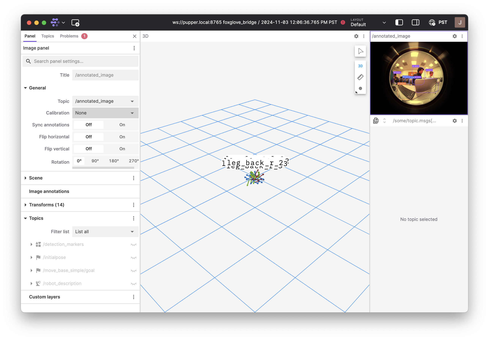

Lab 7: Seeing is Believing
=============================================

*Goal: Use computer vision to enable Pupper to follow a person by processing (fisheye) camera input!*

In this lab, you’ll leverage computer vision to detect a person in Pupper's field of view and control its movement to follow that person. You’ll implement a simple tracking and searching behavior using a state machine, allowing Pupper to maintain focus on the target when visible and initiate a search if the target moves out of view.

**Note:** The object detector used in this lab can detect multiple types of objects. However, for simplicity in this lab, the detection array has already been filtered to only include detections of people. This ensures that Pupper will respond solely to human targets.

`Lab slides <https://docs.google.com/presentation/d/1B9dPRIVNvwTZaD_4BA07pDRL4pYIENYV/edit?usp=sharing&ouid=117110374750562018236&rtpof=true&sd=true>`_

`Lab document <https://docs.google.com/document/d/1GJTvKj6Lzb_mLpU9AYKbbvarJ1d-B2B0UuI5HPmaRoE/edit?usp=sharing>`_

We have installed an Arducam fisheye camera with a Raspberry Pi AI Kit module with the HAILO-8L chip to accelerate CV computations on your Puppers. Feel free to check out the specs here: https://github.com/hailo-ai/hailort.

Step 0. Setup
^^^^^^^^^^^^^^^^^^^^^^^^^^^^^^^^^^^^^^^^^^^^^

1. **Prepare the Environment**  
   
   Download the `the image <https://drive.google.com/file/d/1Zp5iIhjWvLM06CZOQXeZ1I0SiMEy3qEF/view>`_ on your local machine. Then download `balenaEtcher < https://etcher.balena.io/>`_. Use this to flash the new image onto your Pupper's USB by connecting it to your computer (select the flash from file option and select the corresponding Samsung drive).

2. **Run Foxglove**  
   
   Open `Foxglove <https://foxglove.dev/>`_. Make sure to install it locally on your own computer, as the browser version may not work. 
   You’ll use Foxglove (better RVIZ) to visualize Pupper's camera feed, which helps verify and debug object detection. 

   If you are having trouble connecting, try turning internet sharing off, enabling all options, and then turning it back on.

3. **Clone the Starter Code**  
   
   Clone the starter repository from `lab_7_2024 GitHub Repo <https://github.com/cs123-stanford/lab_7_2024>`_ on Pupper ``git clone https://github.com/cs123-stanford/lab_7_2024.git``.

4. **Start the Necessary Processes**  
   
   `cd` into the `lab_7_2024` directory and run the `run.sh` script. **Note:** This script must run continuously in a separate terminal whenever you are testing your code, as it launches nodes for image publishing, object detection, and the RL controller.

5. **Connect Foxglove to the Pi**  
   
   Connect the Pi to your laptop with an Ethernet cable/adapter. In Foxglove, connect to the Pi and visualize the “annotated_image” topic to see the camera feed with bounding boxes around detected people.  
   Confirm that the bounding boxes are appearing correctly, as shown in the last image below.

    Connecting Foxglove to the Raspberry Pi.

    Select the gear icon on the top right panel that says "/camera/image_raw" to configure it. Under "General", set the topic to "/annotated_image" and the calibration to "None". 

    Click the icon with the 3 dots in the top right corner of the window and select "fullscreen".

6. **Review the Starter Code**  
   
   Open `lab_7.py` and take a look at the code structure. Notice the two main callback functions:
   
   - **detection_callback**: Triggered whenever a new detection message is received. This is where you’ll process detections and determine the target’s location.
   - **timer_callback**: Runs periodically to update Pupper’s behavior based on the current state and target position. This is where you’ll implement the control logic for tracking or searching.

   Most of your work will happen in these callbacks, where you’ll add code to process detections and control Pupper based on target visibility.

Step 1. Object Detection
^^^^^^^^^^^^^^^^^^^^^^^^^^^^^^^^^^^^^^^^^^^^^

In this section, you’ll work on extracting and processing target position information from the camera feed.

1. **Inspect Detection Messages**  
   
   Add a breakpoint in `detection_callback` to examine the `detections` message (use ``breakpoint() to open pdb``).  
   Observe the structure of each detection, noting how the position of each bounding box is stored. Check the `ROS Message Documentation <http://docs.ros.org/en/kinetic/api/vision_msgs/html/msg/Detection2DArray.html>`_ to understand the fields of the message.

2. **Extract Bounding Box Positions**  
   
   Print the `x` coordinate of each detected bounding box to see where each detected object appears within the image, following the documentation on how to find the x of each detections object (this is a valuable skill for determining how to find the fields of ROS messages). 

**DELIVERABLE:** How do you get the `x` value of the detection from `msg`. Write out the full line of Python code.

3. **Normalize X Position**  
   
   Convert the `x` position to a range between -1.0 and 1.0 using the `IMAGE_WIDTH` constant, with 0 representing the center of the image. This will help you interpret the target’s position more easily.

4. **Verify Position**  
   
   Print the normalized `x` value and observe how it changes in Foxglove as you move in front of the camera. Make sure that the frame is bounded by the normalization and your value does not extend beyond that range. 

5. **Identify the Most Centered Bounding Box**  
   
   Find the bounding box that is closest to the center of the image (i.e., with an `x` value nearest to 0). This will be your target, and you should save its `x` position in a member variable for use in control logic. *Hint* `msg` of `detection_callback` contains a list of detections. We do a naiive approach where we only want to track the most central of all the detected objects. 

6. **Track the Time of Last Detection**  
   
   In `detection_callback`, update a member variable to store the time of the most recent detection. This variable will later be used in `timer_callback` to determine whether to switch Pupper’s state to "searching" if too much time has passed without a detection.

**DELIVERABLE:** Take a video of you moving across the frame (left/right, up/down), and show the numbers changing within the normalization range. Upload this video with your submission to Gradescope. 

**DELIVERABLE:** To implement this method, we always choose the most central object within the camera frame to have Pupper track. However, there are a number of cases where we Pupper should actually continue tracking the same person, regardless of if they are moving out of the frame, which may not necessarily always be the same person. Can you come up with another method that might accomplish this? How would you make sure that you are tracking the same object (the detections array may change the object index between any given frame)? Write the algorithm you come up with in pseudocode. 

**EXTRA CREDIT** Implement your algorithm from the above deliverable on the Pupper and see how the behavior changes. Take a video and upload to Gradescope. 

Step 2. Visual Servoing
^^^^^^^^^^^^^^^^^^^^^^^^^^^^^^^^^^^^^^^^^^^^^^^^

Now that you can detect and locate the target, you’ll implement a control mechanism to keep Pupper oriented toward it. (Implement in `timer_callback` when `state == TRACK`)

1. **Proportional Control**  
   
   Implement a proportional controller to calculate a yaw velocity command based on the target’s normalized `x` position. Define a proportional gain constant, which controls how quickly Pupper turns to center the target.

2. **Test on Stand**  
   
   Place Pupper on a stand and observe how it adjusts its yaw as you move left and right in front of the camera. It should aim to keep you centered in its view.

3. **Tune on Floor**  
   
   Place Pupper on the floor and adjust the proportional gain for smooth turning. Aim to have it follow you naturally as you move around.

**DELIVERABLE:** Tune the gain so that Pupper is able to keep up with the normal pace of a person walking. How did you go about tuning the gain for smooth turning? Take a video and upload to Gradescope. 

Step 3. Search and Track
^^^^^^^^^^^^^^^^^^^^^^^^^^^^^^^^^^^^^^^^^^^^^

Here, you’ll add a search behavior to help Pupper look for you if it loses sight of the target, allowing it to return to tracking when you’re back in view. You'll also command a forward velocity so that the robot follows when you are detected.

1. **Search Mode** (Implement in `timer_callback` when `state == SEARCH`)  
   
   Set a constant yaw velocity to make Pupper rotate in a specific direction (left or right) based on where it last saw the target.

2. **Implement State Transitions**  
   
   - **Track to Search Transition**  
     
     In `timer_callback`, use the member variable for the time of the last detection to check how much time has passed since Pupper last saw the target.  
     If this time exceeds a defined threshold, switch to the `SEARCH` state.

   - **Search to Track Transition**  
     
     If a detection occurs within the timeout period, switch back to `TRACK` mode.

   - **Test Transitions**  
     
     Place Pupper on the floor and ensure that it enters search mode when the target is out of view, then resumes tracking when the target reappears.

3. **Move Forward While Tracking**  
   
   When in `TRACK` mode, set a positive linear velocity to make Pupper advance toward the target.

4. **Tune Constants**  
   
   Experiment with different values for the proportional gain, timeout threshold, search yaw velocity, and forward velocity to make Pupper’s behavior smooth and responsive.

**DELIVERABLE:** Upload a video of Pupper tracking a person using the camera. Write about some of the deficiencies in the current implementation, and what you think may help fix it. 

By the end of this lab, you will have implemented a basic computer vision-based tracking system that enables Pupper to autonomously follow a person. The simple state machine will allow Pupper to handle target loss by searching for the target, making the tracking behavior more robust. Experiment with tuning to optimize Pupper’s performance. Enjoy watching Pupper follow you around!
